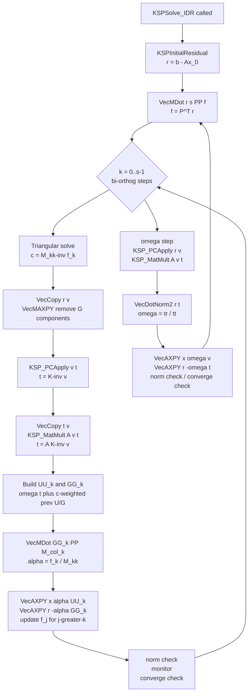

# Implementation Plan: KSPIDR — IDR(s) Krylov Solver

## Background

**IDR(s)** (Induced Dimension Reduction) is a short-recurrence Krylov method for general
nonsymmetric linear systems Ax = b. Key references:

- van Gijzen & Sonneveld, *ACM TOMS* 38(1), 2011 — Algorithm 2 is the practical variant to implement
- Sleijpen & van Gijzen, *SISC* 33(5), 2011 — improved convergence theory

IDR(1) is mathematically equivalent to BiCGSTAB (`KSPBCGS`). For s > 1, IDR(s) converges
significantly faster than BiCGSTAB at the cost of s additional vectors. Typical sweet spot is
s = 4 or s = 8.

### Comparison with existing PETSc methods

| Method | Memory | Restart stagnation | Convergence on hard problems |
|--------|--------|-------------------|------------------------------|
| `KSPBCGS` (BiCGSTAB) | O(n) | No | Often poor |
| `KSPBCGSL` | O(ln) | No | Better |
| `KSPGMRES` | O(kn) | Yes | Best but memory-limited |
| **`KSPIDR` (s=4)** | O(7n) | **No** | Competitive with GMRES(50+) |

---

## Files to Create

```
src/ksp/ksp/impls/idr/
  idrimpl.h    private struct KSP_IDR; PETSC_INTERN forward declarations
  idr.c        all implementation and public API functions
  makefile     three-line build file
```

## Files to Modify

| File | Change |
|------|--------|
| `include/petscksp.h` | Add `#define KSPIDR "idr"` and `KSPIDRSetS`/`KSPIDRGetS` declarations |
| `src/ksp/ksp/interface/itregis.c` | Forward-declare `KSPCreate_IDR`; call `KSPRegister` in `KSPRegisterAll` |
| `doc/manual/ksp.md` | Add row to the KSP methods table after `KSPBCGSL` |
| `doc/overview/linear_solve_table.md` | Add row to the linear solver overview table |

---

## Private Struct (`idrimpl.h`)

```c
/* Private data structure for IDR(s) solver. */
#pragma once

#include <petsc/private/kspimpl.h>

typedef struct {
  PetscInt     s;       /* shadow space dimension; default 4 */
  Vec         *GG;      /* s direction vectors G[0..s-1] */
  Vec         *UU;      /* s update vectors   U[0..s-1] */
  Vec         *PP;      /* s shadow vectors   P[0..s-1] (fixed, random orthonormal) */
  Vec          r;       /* current residual */
  Vec          v;       /* work: K^{-1} current direction */
  Vec          t;       /* work: A v (mat-vec result) */
  PetscScalar *M;       /* s*s matrix M[j,k] = <G[k],P[j]>, column-major */
  PetscScalar *f;       /* length s: P^T r */
  PetscScalar *c;       /* length s: solution of M c = f */
  PetscReal    omega;   /* current relaxation parameter */
} KSP_IDR;

PETSC_INTERN PetscErrorCode KSPSetUp_IDR(KSP);
PETSC_INTERN PetscErrorCode KSPSolve_IDR(KSP);
PETSC_INTERN PetscErrorCode KSPReset_IDR(KSP);
PETSC_INTERN PetscErrorCode KSPDestroy_IDR(KSP);
PETSC_INTERN PetscErrorCode KSPView_IDR(KSP, PetscViewer);
PETSC_INTERN PetscErrorCode KSPSetFromOptions_IDR(KSP, PetscOptionItems);
```

Total heap: 3s `Vec` (via `VecDuplicateVecs`) + 3 single `Vec` + `(s*s + 2s)` scalars.

---

## Memory Allocation Pattern

Follow **GCR** (not BCGSL): use `MatCreateVecs` + `VecDuplicateVecs` inside the private
struct rather than `KSPSetWorkVecs`. This gives explicit control over the `s`-vector families
and matches the destroy pattern in `KSPReset_IDR`.

```c
static PetscErrorCode KSPSetUp_IDR(KSP ksp)
{
  KSP_IDR *idr = (KSP_IDR *)ksp->data;
  Mat      A;

  PetscFunctionBegin;
  PetscCall(KSPGetOperators(ksp, &A, NULL));
  PetscCall(MatCreateVecs(A, &idr->r, NULL));
  PetscCall(VecDuplicateVecs(idr->r, idr->s, &idr->GG));
  PetscCall(VecDuplicateVecs(idr->r, idr->s, &idr->UU));
  PetscCall(VecDuplicateVecs(idr->r, idr->s, &idr->PP));
  PetscCall(VecDuplicate(idr->r, &idr->v));
  PetscCall(VecDuplicate(idr->r, &idr->t));
  PetscCall(PetscMalloc3(idr->s * idr->s, &idr->M,
                         idr->s,          &idr->f,
                         idr->s,          &idr->c));
  /* Initialize shadow space with random orthonormal vectors */
  PetscCall(KSPIDRInitShadowSpace_IDR(ksp));
  PetscFunctionReturn(PETSC_SUCCESS);
}
```

### Shadow Space Initialization (helper, called from `KSPSetUp_IDR`)

```c
static PetscErrorCode KSPIDRInitShadowSpace_IDR(KSP ksp)
{
  KSP_IDR    *idr = (KSP_IDR *)ksp->data;
  PetscRandom rnd;
  PetscInt    k, j;

  PetscFunctionBegin;
  PetscCall(PetscRandomCreate(PetscObjectComm((PetscObject)ksp), &rnd));
  PetscCall(PetscRandomSetSeed(rnd, 0x12345678ULL));
  PetscCall(PetscRandomSeed(rnd));
  for (k = 0; k < idr->s; k++) PetscCall(VecSetRandom(idr->PP[k], rnd));
  PetscCall(PetscRandomDestroy(&rnd));
  /* Modified Gram-Schmidt orthonormalization */
  for (k = 0; k < idr->s; k++) {
    PetscScalar alpha;
    PetscCall(VecNormalize(idr->PP[k], NULL));
    for (j = k + 1; j < idr->s; j++) {
      PetscCall(VecDot(idr->PP[k], idr->PP[j], &alpha));
      PetscCall(VecAXPY(idr->PP[j], -alpha, idr->PP[k]));
    }
  }
  PetscFunctionReturn(PETSC_SUCCESS);
}
```

---

## Algorithm: `KSPSolve_IDR`

Follows **Algorithm 2, van Gijzen & Sonneveld TOMS 2011**, right-preconditioning form.
`KSP_PCApply` and `KSP_MatMult` are called separately (as in GCR) to retain access to the
intermediate result `v = K^{-1} direction`, which is needed to build both `UU[k]` and `GG[k]`
from a single PC/mat-vec pair.

```
Initialise:
  r = b - A x_0              (KSPInitialResidual)
  GG[k] = 0, UU[k] = 0  for k = 0..s-1
  M = 0 (s x s),  omega = 1

Main IDR loop (while not converged):

  // Shadow projection: f = P^T r  [VecMDot: one MPI_Allreduce, s values]
  VecMDot(r, s, PP, f)

  // s bi-orthogonalisation half-steps
  for k = 0..s-1:

    // Triangular solve: find c[0..k-1] such that M[0..k-1, 0..k-1] c = f[0..k-1]
    // (k = 0: nothing to solve)

    // v = r - sum_{j=0}^{k-1} c[j] GG[j]
    VecCopy(r, v)
    if k > 0: VecMAXPY(v, k, neg_c, GG)

    // Apply K^{-1} then A (right PC; retain intermediate)
    KSP_PCApply(ksp, v, t)      // t = K^{-1} v   (note: re-using t temporarily)
    VecCopy(t, v)               // save K^{-1} v in v
    KSP_MatMult(ksp, A, v, t)   // t = A K^{-1} v

    // UU[k] = omega * v + sum_{j=0}^{k-1} c[j] UU[j]
    VecSet(UU[k], 0.0)
    VecAXPY(UU[k], omega, v)
    if k > 0: VecMAXPY(UU[k], k, c, UU)

    // GG[k] = omega * t + sum_{j=0}^{k-1} c[j] GG[j]   (= A K^{-1} UU[k])
    VecSet(GG[k], 0.0)
    VecAXPY(GG[k], omega, t)
    if k > 0: VecMAXPY(GG[k], k, c, GG)

    // Update M column k: M[j,k] = <GG[k], PP[j]>   [VecMDot: one allreduce, s values]
    VecMDot(GG[k], s, PP, M + k*s)

    // alpha = f[k] / M[k,k];  check for breakdown (M[k,k] == 0)
    alpha = f[k] / M[k*s + k]

    // x += alpha * UU[k],   r -= alpha * GG[k]
    VecAXPY(x,    alpha,  UU[k])
    VecAXPY(r,   -alpha,  GG[k])

    // Update remaining shadow projections: f[j] -= alpha * M[j,k] for j > k
    for j = k+1..s-1: f[j] -= alpha * M[k*s + j]

    // Residual norm, monitor, convergence check ...

  // Minimal residual (omega) step
  KSP_PCApply(ksp, r, v)     // v = K^{-1} r
  KSP_MatMult(ksp, A, v, t)  // t = A v
  VecDotNorm2(r, t, &tr, &tt)
  if tt == 0: happy breakdown (converged)
  omega = tr / tt            // minimises ||r - omega*t||_2
  VecAXPY(x,    omega, v)
  VecAXPY(r,   -omega, t)

  // Residual norm, monitor, convergence check ...
```

### Left preconditioning variant

Replace each `KSP_PCApply + KSP_MatMult` pair with a single
`KSP_PCApplyBAorAB(ksp, direction, t, v)` call.  `UU[k]` then directly updates `x`
without a separate `K^{-1}` step; `GG[k]` holds `K^{-1} A UU[k]`.

---

## Breakdown Handling

Two potential breakdown sites:

1. `M[k,k] == 0` in the half-step — `PetscAbsScalar(M[k*s+k]) < breakdown_tol`;
   set `ksp->reason = KSP_DIVERGED_BREAKDOWN`.
2. `tt == 0` in the omega step — residual is effectively zero;
   set `ksp->reason = KSP_CONVERGED_HAPPY_BREAKDOWN`.

---

## Lifecycle Functions

### `KSPReset_IDR`
```c
static PetscErrorCode KSPReset_IDR(KSP ksp)
{
  KSP_IDR *idr = (KSP_IDR *)ksp->data;
  PetscFunctionBegin;
  PetscCall(VecDestroy(&idr->r));
  PetscCall(VecDestroy(&idr->v));
  PetscCall(VecDestroy(&idr->t));
  PetscCall(VecDestroyVecs(idr->s, &idr->GG));
  PetscCall(VecDestroyVecs(idr->s, &idr->UU));
  PetscCall(VecDestroyVecs(idr->s, &idr->PP));
  PetscCall(PetscFree3(idr->M, idr->f, idr->c));
  PetscFunctionReturn(PETSC_SUCCESS);
}
```

### `KSPDestroy_IDR`
```c
static PetscErrorCode KSPDestroy_IDR(KSP ksp)
{
  PetscFunctionBegin;
  PetscCall(KSPReset_IDR(ksp));
  PetscCall(KSPDestroyDefault(ksp));
  PetscCall(PetscObjectComposeFunction((PetscObject)ksp, "KSPIDRSetS_C", NULL));
  PetscCall(PetscObjectComposeFunction((PetscObject)ksp, "KSPIDRGetS_C", NULL));
  PetscFunctionReturn(PETSC_SUCCESS);
}
```

### `KSPView_IDR`
```c
static PetscErrorCode KSPView_IDR(KSP ksp, PetscViewer viewer)
{
  KSP_IDR  *idr = (KSP_IDR *)ksp->data;
  PetscBool isascii;
  PetscFunctionBegin;
  PetscCall(PetscObjectTypeCompare((PetscObject)viewer, PETSCVIEWERASCII, &isascii));
  if (isascii)
    PetscCall(PetscViewerASCIIPrintf(viewer, "  s (shadow space dimension) = %" PetscInt_FMT "\n", idr->s));
  PetscFunctionReturn(PETSC_SUCCESS);
}
```

### `KSPSetFromOptions_IDR`
```c
static PetscErrorCode KSPSetFromOptions_IDR(KSP ksp, PetscOptionItems PetscOptionsObject)
{
  KSP_IDR  *idr = (KSP_IDR *)ksp->data;
  PetscInt  s;
  PetscBool flg;
  PetscFunctionBegin;
  PetscOptionsHeadBegin(PetscOptionsObject, "KSP IDR options");
  PetscCall(PetscOptionsInt("-ksp_idr_s", "Shadow space dimension", "KSPIDRSetS", idr->s, &s, &flg));
  if (flg) PetscCall(KSPIDRSetS(ksp, s));
  PetscOptionsHeadEnd();
  PetscFunctionReturn(PETSC_SUCCESS);
}
```

---

## Public API

### Internal implementations (static)
```c
static PetscErrorCode KSPIDRSetS_IDR(KSP ksp, PetscInt s)
{
  KSP_IDR *idr = (KSP_IDR *)ksp->data;
  PetscFunctionBegin;
  PetscCheck(s >= 1, PetscObjectComm((PetscObject)ksp), PETSC_ERR_ARG_OUTOFRANGE,
             "Shadow space dimension s must be >= 1, got %" PetscInt_FMT, s);
  PetscValidLogicalCollectiveInt(ksp, s, 2);
  if (!ksp->setupstage) {
    idr->s = s;
  } else if (idr->s != s) {
    PetscCall(KSPReset_IDR(ksp));
    idr->s          = s;
    ksp->setupstage = KSP_SETUP_NEW;
  }
  PetscFunctionReturn(PETSC_SUCCESS);
}

static PetscErrorCode KSPIDRGetS_IDR(KSP ksp, PetscInt *s)
{
  KSP_IDR *idr = (KSP_IDR *)ksp->data;
  PetscFunctionBegin;
  *s = idr->s;
  PetscFunctionReturn(PETSC_SUCCESS);
}
```

### Public wrappers (declared `PETSC_EXTERN` in `include/petscksp.h`)
```c
PetscErrorCode KSPIDRSetS(KSP ksp, PetscInt s)
{
  PetscFunctionBegin;
  PetscTryMethod(ksp, "KSPIDRSetS_C", (KSP, PetscInt), (ksp, s));
  PetscFunctionReturn(PETSC_SUCCESS);
}

PetscErrorCode KSPIDRGetS(KSP ksp, PetscInt *s)
{
  PetscFunctionBegin;
  PetscUseMethod(ksp, "KSPIDRGetS_C", (KSP, PetscInt *), (ksp, s));
  PetscFunctionReturn(PETSC_SUCCESS);
}
```

---

## `KSPCreate_IDR` (PETSC_EXTERN)

```c
PETSC_EXTERN PetscErrorCode KSPCreate_IDR(KSP ksp)
{
  KSP_IDR *idr;
  PetscFunctionBegin;
  PetscCall(PetscNew(&idr));
  idr->s     = 4;     /* default shadow space dimension */
  idr->omega = 1.0;
  ksp->data  = (void *)idr;

  PetscCall(KSPSetSupportedNorm(ksp, KSP_NORM_PRECONDITIONED,   PC_LEFT,  3));
  PetscCall(KSPSetSupportedNorm(ksp, KSP_NORM_UNPRECONDITIONED, PC_RIGHT, 2));
  PetscCall(KSPSetSupportedNorm(ksp, KSP_NORM_NONE,             PC_RIGHT, 1));

  ksp->ops->setup          = KSPSetUp_IDR;
  ksp->ops->solve          = KSPSolve_IDR;
  ksp->ops->reset          = KSPReset_IDR;
  ksp->ops->destroy        = KSPDestroy_IDR;
  ksp->ops->view           = KSPView_IDR;
  ksp->ops->setfromoptions = KSPSetFromOptions_IDR;
  ksp->ops->buildsolution  = KSPBuildSolutionDefault;
  ksp->ops->buildresidual  = KSPBuildResidualDefault;

  PetscCall(PetscObjectComposeFunction((PetscObject)ksp, "KSPIDRSetS_C", KSPIDRSetS_IDR));
  PetscCall(PetscObjectComposeFunction((PetscObject)ksp, "KSPIDRGetS_C", KSPIDRGetS_IDR));
  PetscFunctionReturn(PETSC_SUCCESS);
}
```

---

## Registration (`itregis.c`)

Add the forward declaration near the other `PETSC_EXTERN` declarations (after `KSPHPDDM`):
```c
PETSC_EXTERN PetscErrorCode KSPCreate_IDR(KSP);
```

Add in `KSPRegisterAll()` (after the `KSPHPDDM` block):
```c
PetscCall(KSPRegister(KSPIDR, KSPCreate_IDR));
```

---

## `include/petscksp.h` Additions

After `#define KSPHPDDM "hpddm"`:
```c
#define KSPIDR "idr"
```

Near the `KSPGCRSetRestart` / `KSPBCGSLSetEll` declarations:
```c
PETSC_EXTERN PetscErrorCode KSPIDRSetS(KSP, PetscInt);
PETSC_EXTERN PetscErrorCode KSPIDRGetS(KSP, PetscInt *);
```

---

## `makefile` (copy from any existing impl)

```makefile
-include ../../../../../petscdir.mk

MANSEC = KSP

include ${PETSC_DIR}/lib/petsc/conf/variables
include ${PETSC_DIR}/lib/petsc/conf/rules_doc.mk
```

---

## Documentation Table Entries

### `doc/manual/ksp.md` — insert after the `KSPBCGSL` row (currently line 374)

```rst
  * - IDR(s) :cite:`van2011idr`
    - ``KSPIDR``
    - ``idr``
```

The cite key `van2011idr` should reference:
> M. B. van Gijzen and P. Sonneveld, "Algorithm 913: An Elegant IDR(s) Variant that
> Efficiently Exploits Biorthogonality Properties", *ACM TOMS* 38(1), 2011.

Add the BibTeX entry to the project's `.bib` file (find it via
`grep -r "cite.*v:92" doc/` to locate the BiCGSTAB entry and add IDR(s) nearby).

### `doc/overview/linear_solve_table.md` — insert after the `KSPBCGSL` entry

The table has columns: Method, KSPType, External Packages, Parallel, Complex.
IDR(s) is a native PETSc method, supports parallel, and works for complex scalars:

```rst
   * - IDR(s) - Induced Dimension Reduction
     - ``KSPIDR``
     - ---
     - X
     - X
```

---

## The `/*MC` Docstring for `KSPIDR`

Place above `KSPCreate_IDR` in `idr.c`:

```c
/*MC
   KSPIDR - IDR(s): Induced Dimension Reduction method for general nonsymmetric
   linear systems {cite}`van2011idr`.

   Options Database Key:
.  -ksp_idr_s <s> - shadow space dimension (default 4); larger s improves
   convergence at the cost of s additional vectors and s extra inner products
   per step, see `KSPIDRSetS()`

   Level: intermediate

   Notes:
   IDR(s) is a short-recurrence, non-restarting Krylov method for general
   nonsymmetric linear systems. It requires no growing subspace and avoids
   the restart stagnation of `KSPGMRES`. The parameter s controls the
   trade-off between memory and convergence speed\: s=1 is mathematically
   equivalent to `KSPBCGS` (BiCGSTAB); s=4 typically converges as fast as
   GMRES(50); s=8 often outperforms GMRES(100).

   Memory usage is (3s+3) vectors plus an s-by-s dense matrix.

.seealso: [](ch_ksp), `KSPCreate()`, `KSPSetType()`, `KSPType`, `KSP`,
          `KSPBCGS`, `KSPBCGSL`, `KSPGMRES`, `KSPIDRSetS()`, `KSPIDRGetS()`
M*/
```

---

## Data-flow Diagram



---

## Test Strategy

### Test 1 — Basic convergence

Add a `TEST` block to `src/ksp/ksp/tutorials/ex2.c` (standard nonsymmetric driven-cavity
problem):

```c
/*TEST
  test:
    suffix: idr_s4
    args: -n 10 -ksp_type idr -ksp_idr_s 4 -ksp_rtol 1e-8
    output_file: output/ex2_idr_s4.out

  test:
    suffix: idr_s1
    args: -n 10 -ksp_type idr -ksp_idr_s 1 -ksp_rtol 1e-8
    output_file: output/ex2_idr_s1.out

  test:
    suffix: bcgs_for_idr_s1
    args: -n 10 -ksp_type bcgs -ksp_rtol 1e-8
    output_file: output/ex2_idr_s1.out
TEST*/
```

The `idr_s1` and `bcgs_for_idr_s1` tests share the same `.out` file to assert that IDR(1)
produces numerically identical results to BiCGSTAB.

### Test 2 — Parallel
Same as Test 1 with `nsize: 4` to confirm the `VecMDot` allreduce is correct across ranks.

### Test 3 — Right vs. left preconditioning
Run with `-ksp_pc_side right` and `-ksp_pc_side left` to confirm both supported norm types
work without divergence.

---

## Implementation Order

Model guidance: use **Opus** for Step 5 (the core IDR(s) recurrence requires careful
mathematical reasoning to get exactly right). Use **Sonnet** for all other steps —
they are mechanical edits, boilerplate patterns, and test harness work that is fully
specified in this document.

| Step | File(s) touched | Validates | Model |
|------|----------------|-----------|-------|
| 1 | `petscksp.h`, `itregis.c` | Library builds with stub `KSPCreate_IDR` | Sonnet |
| 2 | `makefile` | Build system picks up new directory | Sonnet |
| 3 | `idrimpl.h` | Struct layout compiles | Sonnet |
| 4 | `KSPSetUp_IDR` | Memory layout; shadow-space init | Sonnet |
| 5 | `KSPSolve_IDR` | Algorithm correctness | **Opus** |
| 6 | `KSPReset_IDR`, `KSPDestroy_IDR` | No memory leaks | Sonnet |
| 7 | `KSPView_IDR`, `KSPSetFromOptions_IDR` | `-ksp_view`, `-help` output | Sonnet |
| 8 | `KSPIDRSetS` / `KSPIDRGetS` | Public API usable from user code | Sonnet |
| 9 | `KSPCreate_IDR` | Full registration; `-ksp_type idr` selectable | Sonnet |
| 10 | `make all` | Zero compiler warnings | Sonnet |
| 11 | Tutorial test block | IDR(4) converges on nonsymmetric problem | Sonnet |
| 12 | IDR(1) == BiCGSTAB test | Algorithm correctness of s=1 case; debug with Opus if mismatch | Sonnet |
| 13 | `doc/manual/ksp.md` | New row in KSP methods table | Sonnet |
| 14 | `doc/overview/linear_solve_table.md` | New row in overview table | Sonnet |

### Why Opus for Step 5 only

**`KSPSolve_IDR`** requires Opus because it involves:

- Maintaining the column-major dense matrix M and solving the growing lower-triangular
  system at each half-step (k goes 0..s-1; the system grows by one row/column each time)
- Correct index arithmetic for the `f` and `c` arrays across the inner loop without
  off-by-one errors in the `M[k*s + j]` access pattern
- Choosing the precise `VecMAXPY` argument ordering so that `UU[k]` and `GG[k]` are
  updated consistently — swapping their order silently produces a wrong but
  still-converging method
- Breakdown detection at two distinct sites with different `KSPConvergedReason` codes
- Matching van Gijzen & Sonneveld TOMS 2011 Algorithm 2 exactly so that IDR(1) reduces
  to BiCGSTAB identically (the sanity check in Step 12)

All other steps are copy-from patterns with exact PETSc API calls given above; Sonnet
can execute them from this specification without additional reasoning.
